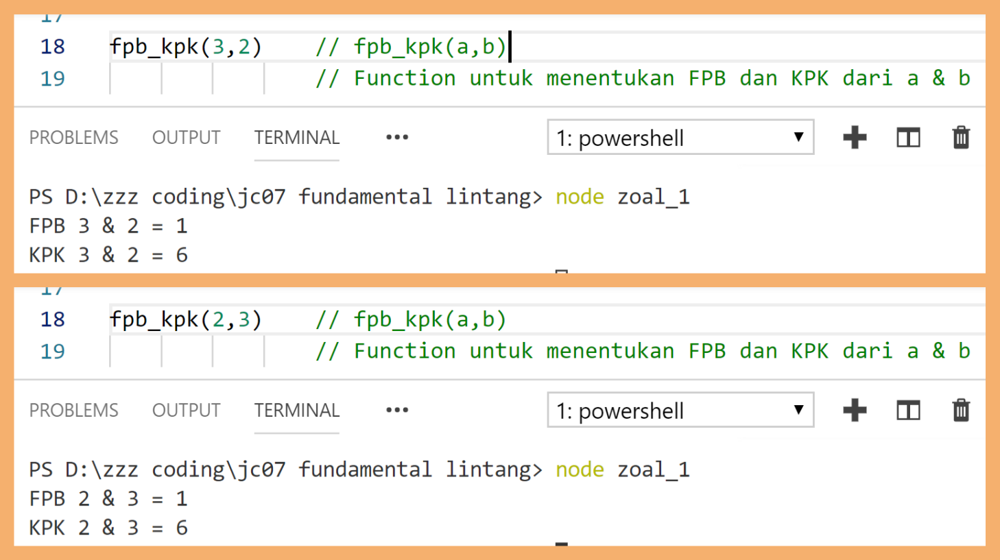
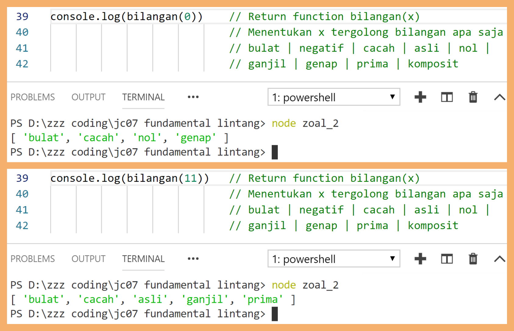
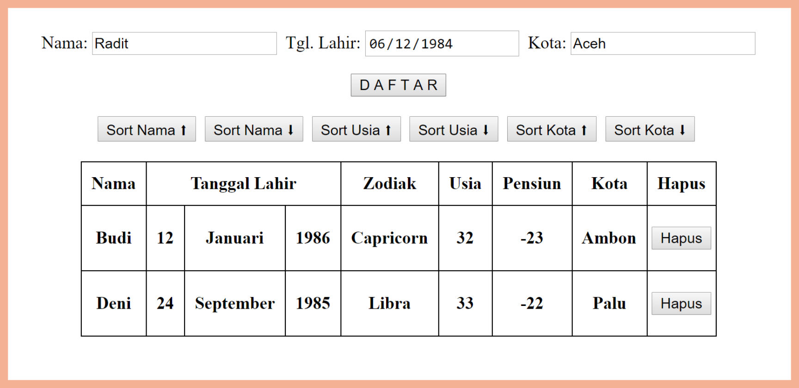

# Soal Ujian JavaScript Fundamental JC-07


Panduan selengkapnya klik video berikut atau [klik di sini!](https://www.youtube.com/watch?v=2IjWMVZntq8)

[](https://www.youtube.com/watch?v=2IjWMVZntq8)

#
### **Soal 1 - FPB & KPK**

Buatlah sebuah __file JavaScript__ yang mengandung **sebuah function (dengan 2 parameter)** untuk menentukan nilai **FPB** (_Faktor Persekutuan Besar_) & **KPK** (_Kelipatan Persekutuan Kecil_) dari 2 buah bilangan. Pembahasan seputar FPB & KPK pernah kita pelajari bersama di bangku Sekolah Dasar, masih ingat dong?

- Function yang dieksekusi:

  ```javascript
  fpb_kpk(2,3)
  ```

- Output yang diharapkan:
  ```bash
  FPB 2 & 3 = 1
  KPK 2 & 3 = 6
  ```

- Contoh screenshot

  

>_**Catatan:**_ *Commit/upload jawaban soal pertama ke akun Github Anda dengan nama repo: **FPB_KPK**. Salin file JavaScript ke dalam format .txt, sertakan pula link url repo Github ini. Kemudian kirimkan via email ke lintang@purwadhika.com dengan subject email: __JS-Soal1-namaAnda__.*

#
### **Soal 2 - Kategori Bilangan**

Buatlah sebuah __file JavaScript__ yang mengandung **sebuah return function (dengan 1 parameter)** untuk menentukan kategori bilangan sebuah angka. Misal: angka __13__ tergolong bilangan __*bulat*__, **_cacah_**, *__asli__*, **_ganjil_** & __*prima*__. Berikut adalah definisi & pengkategorian bilangan menurut laman Wikipedia [(klik di sini)](https://id.wikipedia.org/wiki/Bilangan):

- __Bilangan Bulat__: Bilangan yang terdiri atas bilangan cacah (0, 1, 2, 3, ...) beserta nilai negatifnya (0, -1, -2, -3, ...). Bilangan bulat dapat dituliskan tanpa komponen desimal atau pecahan.

- __Bilangan Cacah__: Himpunan bilangan bulat yang tidak bernilai negatif, yaitu (0, 1, 2, 3 ...).

- __Bilangan Negatif__: Himpunan bilangan bulat yang nilainya lebih kecil dari 0, yaitu (-1, -2, -3, ...)

- __Bilangan Nol__: Yaitu 0

- __Bilangan Asli__: Himpunan bilangan cacah positif yang bukan nol, yaitu (1, 2, 3, ...)

- __Bilangan Ganjil__: Himpunan bilangan asli positif yang nilainya tidak habis dibagi 2, yaitu (1, 3, 5, 7, 9, ...)

- __Bilangan Genap__: Himpunan bilangan asli positif yang nilainya habis dibagi 2, yaitu (2, 4, 6, 8, 10, ...). Bilangan nol (0) juga digolongkan sebagai bilangan genap.

- __Bilangan Prima__: Himpunan bilangan asli yang nilainya lebih besar daripada 1, yang faktor pembaginya adalah 1 dan bilangan itu sendiri. 2 dan 3 adalah bilangan prima. 4 bukan bilangan prima karena dapat dibagi 2.

- __Bilangan Komposit__: Himpunan bilangan asli yang nilainya lebih besar daripada 1, yang bukan merupakan bilangan prima.

  

Function yang dieksekusi:

  ```javascript
  console.log(bilangan(13))
  ```

Output yang diharapkan:
  ```bash
  [ 'bulat', 'cacah', 'asli', 'ganjil', 'prima' ]
  ```

Contoh screenshot

  

>_**Catatan:**_ *Commit/upload jawaban soal kedua ke akun Github Anda dengan nama repo: **Kategori_Bilangan**. Salin file JavaScript ke dalam format .txt, sertakan pula link url repo Github ini. Kemudian kirimkan via email ke lintang@purwadhika.com dengan subject email: __JS-Soal2-namaAnda__.*

#
### **Soal 3 - Data Tabel**

Buatlah sebuah __file HTML__ yang mengandung __script JavaScript__, yang dapat memproses input dari user kemudian menampilkannya dalam bentuk tabel, mensortir data berdasarkan properti tertentu & menghapus data tertentu. 

__*Requirements*__:

- User dapat mengisi data __nama__, __tanggal lahir__ dan __kota__. Saat tombol __DAFTAR__ ditekan, otomatis akan menampilkan data dari user tersebut dalam bentuk __tabel__.

- Data tabel yang ditampilkan memiliki kolom berikut: 
  - __Nama__, 
  - __Tanggal Lahir__ (*terdiri atas 3 sub-kolom: __tanggal__, __bulan__ & __tahun__*), 
  - __Zodiak__ (referensi Zodiak silakan Googling), 
  - __Usia__, 
  - __Pensiun__ (berapa tahun lagi akan pensiun. Usia pensiun = 55 tahun), 
  - __Kota__, 
  - serta memiliki tombol __Hapus__ untuk menghapus data.

- Disediakan pula __6 buah tombol__ untuk mensortir data berdasarkan kolom __Nama__, __Usia__ & __Kota__, baik secara __Ascending__ maupun __Descending__.

- Contoh screenshot

  

>_**Catatan:**_ *Commit/upload jawaban soal ketiga ke akun Github Anda dengan nama repo: **Data_Tabel**. Salin file HTML ke dalam format .txt, sertakan pula link url repo Github ini. Kemudian kirimkan via email ke lintang@purwadhika.com dengan subject email: __JS-Soal3-namaAnda__.*

#

*__#HappyCoding__*

#### Lintang Wisesa :love_letter: _lintangwisesa@ymail.com_

[Facebook](https://www.facebook.com/lintangbagus) | 
[Twitter](https://twitter.com/Lintang_Wisesa) |
[Google+](https://plus.google.com/u/0/+LintangWisesa1) |
[Youtube](https://www.youtube.com/user/lintangbagus) |
:octocat: [GitHub](https://github.com/LintangWisesa) |
[Hackster](https://www.hackster.io/lintangwisesa)